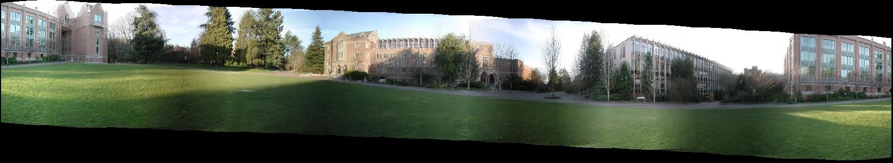
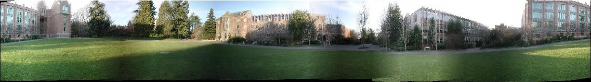
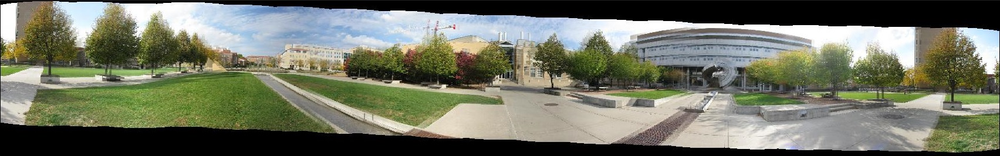
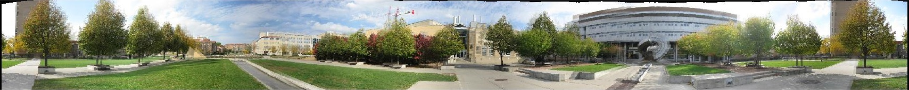

# Homogrpahies and Mosaics
CS 766 panorama project

## Introduction
The panorama project was started with the goal of realizing an implementation of panorama mosaics using a multitude of images. Using images resulting from a rotation of the camera about the camera's optical center, a larger image providing a much fuller field of view can be realized. The project was done in a Matlab environment to ease implementation in feature matching. The program can be run by issuing the following command:
* main(directory, focal length, sampling intervals) where "directory" is the directory containing the image, "focal length" is the focal length of the camera used in obtaining the images, and "k" is the number of iterations that RANSAC is sampling

## Implementation Details
To use the program, a directory is provided along with several other parameters to be described later. All images from the directory are loaded with the assumption that the images are in left-right order - that is, the images were taken with the first image being the leftmost of the resulting panorama.

### Cylindrical Projection
To avoid using a reference image during the panorama generation, a cylindrical projection was used to convert images into a representation on a cylinder. In addition, the use of cylindrical projections means that the shift from image to image is purely translational, and full homography image warps aren't necessary. This is accomplished via the following equations:
* x_b = focalLength * atan((x - x_c) / focalLength) + x_c;
* y_b = focalLength * (y - y_c) / sqrt((x - x_c)^2 + focalLength^2) + y_c;

### Feature Matching
The first step of peforming mosaics is to identify common features between adjacent images. For this implementation, SIFT features were used thanks to a nice [library](http://www.cs.ubc.ca/~lowe/keypoints/) from Professor David Lowe. Also included was a matching library that yields potential matches between the SIFT features. However, the features can contain several outliers. For this reason, the RANSAC algorithm was used.

### RANSAC and Homographies
RANSAC is an easy to implement algorithm that optimistically finds the optimal number of inliers in a set. In our case, the set is a homography computed from sampled matches returned from the matching library. Recall that a homography is simply a warping of an image. The main goal of mosaics is to find a homography between all adjacent images based on the matches between the images. 

RANSAC works by sampling 4 potential matches and computing the homography between the coordinates and the matched projections. This homography is then applied to the rest of the set of matches and compared to the actual match projections. If the difference between the projections is less than some threshold (in our case 0.6), then the homography is accurate for that match. Given a number of sampling intervals, the maximum set of the inliers, or matches that fall within the accepted range, is computed. The overall homography between the images is then calculated using these inliers.

### Stitching and Blending
Once the homographies between each image are known, we now know the displacements of each image relative to its neighbor. The images are then stitched together one at a time, while each image is displaced the computed amount. 

In order to ensure smooth transitions between images, a feathering blending function is used in the regions where two pictures overlap. The feathering function works by first identifying the overlapped range. Once the range is determined, pixels in the overlap range are weighted based on their relative location to the border of the overlap. For instance, pixels closest to the left edge of the overlap will be heavily weighted in the pixel value of the left image, while pixels on the right edge of the overlap are proportionally weighted for the right image's pixel.

After feathering was done, the image was corrected for drift. Panorama images tend to have a downwards drift that accumulates as you stitch images and can be significant by the time your stitching is complete. A simple linear transformation of the form y' = y + ax was used to realign the first and last images to obtain the *a* value. Once this was known, the image with drift was remapped to remove the drift. The additional space at the bottom of the image was also cropped out as well yielding an straightened image.

## Results
Test images with drift

Test images without drift

Building with drift

Building without drift

## Libraries and Acknowledgments
* [David Lowe SIFT Library](http://www.cs.ubc.ca/~lowe/keypoints/)
